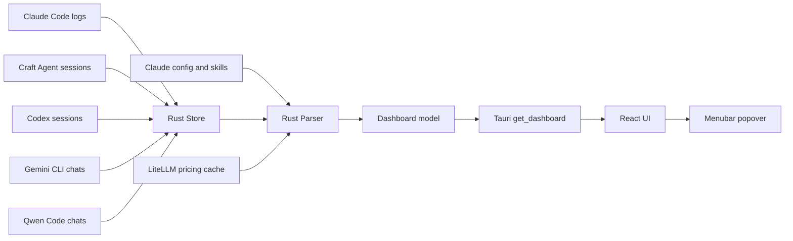

# CraftMeter Architecture

CraftMeter 当前主线是 **Tauri + React + Rust**：React 负责展示，Tauri 负责 menubar/window/commands，Rust 负责日志扫描、cache、定价和聚合。

## 目录结构

```text
CraftMeter/
├── package.json
├── index.html
├── vite.config.ts
├── tsconfig.json
├── src/
│   ├── App.tsx
│   ├── charts.tsx
│   ├── data.ts
│   └── main.tsx
├── public/
└── src-tauri/
    ├── Cargo.toml
    ├── tauri.conf.json
    ├── build.rs
    ├── icons/
    ├── snapshots/
    └── src/
        ├── main.rs
        ├── lib.rs
        ├── model.rs
        ├── store.rs
        ├── codex.rs
        ├── parser.rs
        ├── pricing.rs
        └── config.rs
```

## 运行时数据流



## 模块职责

### Frontend: `src/`

- `main.tsx`: React entry，只挂载 `App`。
- `App.tsx`: popover dashboard、周期切换、主题、截图与交互状态。
- `charts.tsx`: glyph、segmented control、bar/sparkline/donut/heatmap 等展示原语。
- `data.ts`: `Dashboard` TypeScript 类型、`fetchDashboard()`、格式化工具与主题 token；`fetchDashboard` 接收 day/week/month offset，但不自行计算窗口。

Frontend 的职责是展示 Rust 返回的 `Dashboard`。它不扫描文件，不解析日志，不自行计算价格。

### Backend/App shell: `src-tauri/src/`

- `main.rs`: native entry，调用 library `run()`。
- `lib.rs`: Tauri builder、tray、window positioning、autostart、commands、background refresh 和 watcher。
- `model.rs`: Rust 到 React 的序列化数据模型。
- `store.rs`: 增量读取日志、维护 offset manifest、dedupe message、写 cache；当前编排 Claude Code、Craft Agent、Codex、Gemini CLI、Qwen Code。
- `codex.rs`: Codex JSONL stateful parser，只提取 `token_count.last_token_usage` 统计事实。
- `parser.rs`: 将 `RawEvent` 聚合成 day/week/month dashboard、模型列表、客户端工具分布、趋势、热力图和 Craft attribution。
- `pricing.rs`: LiteLLM price table 获取与缓存。
- `config.rs`: 读取用户安装的 MCP servers 与全局 Skills。

## 核心语义

- `RawEvent` 事实层包含 timestamp、session、model、project、input/cache/output/reasoning tokens、tool/source、MCP、Skills 与 Craft attribution。
- `Store` 只保存 provider/config/price-independent facts，即 `RawEvent`。
- `parser::build_dashboard()` 每次基于当前时间窗口、用户配置和价格表重新聚合。
- `store` 用 `STORE_VERSION` 控制 cache schema；解析逻辑变化必须 bump version。
- 写 cache 使用 atomic replace，避免 crash 留下半写 JSON。
- 同一 assistant message 可分多行写入，按 message id merge tool calls，token 只计一次。
- `PeriodReport.clients` 是按 AI 客户端来源聚合的工具分布；当前由 `RawEvent.tool` 承载来源语义，例如 `craft-agent`、`claude-code`、`codex`、`gemini-cli`、`qwen-code`。
- `PeriodReport.projects` 是按 `RawEvent.project` 聚合的项目分布，用于回答“费用和 token 花在哪个项目”。
- `PeriodReport.window` 描述当前报表窗口；前端通过 day/week/month offset 请求上一日、上一周、上一月等历史自然窗口，但聚合仍由 Rust 完成。
- `Dashboard.craft.tools` 后端继续保留 Craft Agent 工具调用事实；当前 UI 暂时不渲染工具调用列表，避免面板噪音，未来可无 schema 迁移恢复。
- Codex 接入只读取 `~/.codex/sessions/**/*.jsonl` 中的 `session_meta`、`turn_context` 和 `event_msg/token_count` 统计事实；token 采用 `last_token_usage`，避免累计值重复计数；reasoning token 独立进入 `reasoning_tok`，状态机在 `codex.rs`，`store.rs` 只做增量读取编排。
- Gemini CLI / Qwen Code 读取 `~/.gemini/tmp/**/chats/*.jsonl` 与 `~/.qwen/tmp/**/chats/*.jsonl` 的 assistant `usageMetadata`；`promptTokenCount` 扣除 `cachedContentTokenCount`，`thoughtsTokenCount` 进入 reasoning。
- React 只展示 `clients`，不从日志路径、模型名或 Craft tool calls 反推客户端来源。
- truncated/rewritten log file 会先 purge 自己的旧 events，再重读，保证幂等。

## 隐私边界

- 读取本机 `~/.claude/projects`、`~/.craft-agent/workspaces`、`~/.codex/sessions`、`~/.gemini/tmp`、`~/.qwen/tmp`、`~/.claude.json` 和 `~/.claude/skills`。
- cache 只保存统计事实、tool/source/category/status 等轻量字段。
- 不上传任何数据。
- 不应将真实 session 内容提交到仓库。

## 打包产物

Tauri bundle 由 `src-tauri/tauri.conf.json` 管理。常用命令：

```bash
npm run build
cargo test --manifest-path src-tauri/Cargo.toml
npm run tauri build
```

macOS 本机产物通常位于：

```text
src-tauri/target/release/bundle/macos/CraftMeter.app
src-tauri/target/release/bundle/dmg/*.dmg
```

当前 bundle targets 包含 `app`, `dmg`, `nsis`；跨平台 installer 是否产出取决于本机工具链。

## 设计原则

1. **一个活架构**：主分支只保留 Tauri/React/Rust 当前实现；旧 Swift 实现留在 Git 历史。
2. **Rust 负责真相**：扫描、聚合、定价、cache 不进入 React。
3. **React 负责表达**：UI 只消费 `Dashboard`，不制造第二套数据协议。
4. **增量读取可验证**：manifest、source purge、message-id dedupe 是 ingestion 的核心不变量。
5. **小步重构**：优先清除旧系统，再拆分 `lib.rs` app shell；`store.rs` 和 `parser.rs` 先保持稳定。
