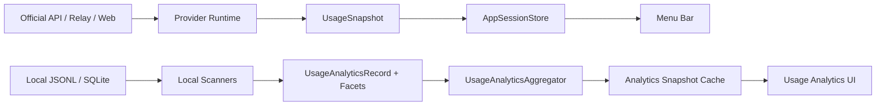

# CraftMeter Architecture

## 1. 两条数据流

CraftMeter 不把实时额度与历史消费混成一个模型。



- `UsageSnapshot`：现在还能用多少、何时重置、鉴权是否健康。
- `UsageAnalyticsSnapshot`：过去用了多少、由哪个客户端/模型/项目产生、费用是否已知。

## 2. SwiftPM 边界

| Target | 职责 |
| --- | --- |
| `OhMyUsageDomain` | Provider、额度和认证的稳定领域模型 |
| `OhMyUsageInfrastructure` | Keychain 等基础设施契约 |
| `OhMyUsageProviders` | Provider runtime 协议 |
| `OhMyUsageApplication` | analytics 契约、纯聚合器、缓存、刷新策略 |
| `OhMyUsagePresentation` | 纯展示模型 |
| `OhMyUsageFeatures` | feature 描述与组装 |
| `OhMyUsageBootstrap` | composition root |
| `OhMyUsage` | CraftMeter executable，承载 App/UI/Services/Providers/Resources |

产品名已经是 CraftMeter；target 名暂时保留，以控制换底座迁移风险。

## 3. Analytics 事实模型

`UsageAnalyticsRecord` 是请求/会话级核心事实：

- source / eventAt
- clientID / clientName
- providerID / providerName / providerCategory
- modelID
- projectID / projectName
- sessionID / requestID
- input / output / cache read / cache write / reasoning token
- estimatedCostUSD / pricingState

多值维度进入 `UsageAnalyticsFacetEvent`：

- MCP server
- Skill
- Craft source
- Craft tool
- Craft category
- Craft status
- permission mode
- thinking level

这样新增 facet 不需要继续膨胀 record 的 optional 字段。

## 4. 本地扫描

| Source | Path | 关键口径 |
| --- | --- | --- |
| Claude Code | `~/.claude/projects/**/*.jsonl` | assistant usage；跨行按稳定签名去重 |
| Codex | `~/.codex/sessions/**/*.jsonl` | 只计单次 last usage，不计累计 total usage |
| Kimi | `~/.kimi/sessions/**/wire.jsonl` | 复用上游 scanner |
| Gemini CLI | `~/.gemini/tmp/**/chats/*.jsonl` | prompt 扣 cached；candidate 扣 thoughts |
| Qwen Code | `~/.qwen/tmp/**/chats/*.jsonl` | 与 Gemini CLI 相同口径 |
| Craft Agents | `~/.craft-agent/workspaces/**/session.jsonl` | session metadata + tool facets；不保存 tool input/result |

Scanner 只读取统计字段。单个损坏行被忽略，单一来源不可用不影响其他来源。

## 5. 去重

跨来源重复事件使用以下统计签名：

```text
client + model + token components + minute bucket
```

同签名冲突时保留 priority 更高的来源。reasoning token 已纳入签名。

来源内部优先使用 request/message/session ID；无稳定 ID 时才使用 fallback signature。

## 6. 价格语义

- `priced`：当前记录费用可确定。
- `unknown`：至少一个请求无价格。
- UI 对 unknown 显示 `≥$x.xx`，不把未知费用伪装成 `$0.00`。

Craft Agents 日志若带 `costCents`，直接转为 USD；其他本地来源在接入统一 pricing catalog 前标记 unknown。

## 7. 缓存与刷新

- `UsageAnalyticsSnapshotCacheStore` 使用 schema version。
- 不兼容 payload 直接忽略并重建。
- source fingerprint 覆盖 CCSwitch、Codex、Claude、Kimi、Gemini、Qwen、Craft Agents。
- 菜单/设置先读 cache，后台刷新。
- 当前 scanner 使用文件 snapshot cache；下一阶段引入 byte-offset event store，避免大型 append-only 日志重复解析。

## 8. 存储迁移

新写入目录：

```text
~/Library/Application Support/CraftMeter
```

迁移规则：

- 只读导入 `~/Library/Application Support/OhMyUsage`。
- 旧目录不删除。
- Keychain 从 `oh-myusage` / `OhMyUsage` 单向迁移到 `craftmeter`。
- LaunchAgent 使用 `com.heyhuazi.craftmeter.app.launchatlogin`。

## 9. 首次启动与可见性

CraftMeter 使用 `LSUIElement` 与 accessory activation policy，是菜单栏应用而不是常规 Dock 应用。

启动顺序：

1. 获取单实例锁。
2. 创建 `StatusBarController` 并启动运行时。
3. 优先展示待处理的更新说明。
4. 若没有更新说明且当前首次启动体验版本未完成，则打开设置窗口一次。
5. 后续启动仅驻留菜单栏；再次启动已有实例会激活设置窗口。

`FirstLaunchExperienceStore` 只保存已完成的体验版本整数。提升版本可为既有用户重新展示必要的启动说明，而无需污染 `AppViewModel`。

## 10. 分发模式

`scripts/package_dmg.sh` 明确区分：

- `development`：本地开发，允许 ad-hoc 签名。
- `preview`：公开但未公证的 Preview，允许 ad-hoc 签名并必须披露 Gatekeeper 限制。
- `release`：正式分发，强制 Developer ID 签名和 Apple 公证；缺少凭据立即失败。

当前 GitHub Actions 使用 `preview`。未来取得 Apple Developer 凭据后，只切换模式并注入签名/公证变量，不改变应用架构或 bundle identity。


## 11. 隐私不变量

禁止进入 analytics model/cache：

- prompt
- assistant content
- tool input
- tool result
- attachment body

测试 fixture 使用显式 PRIVATE marker，验证这些正文不会出现在 `UsageAnalyticsRecord` 描述中。
